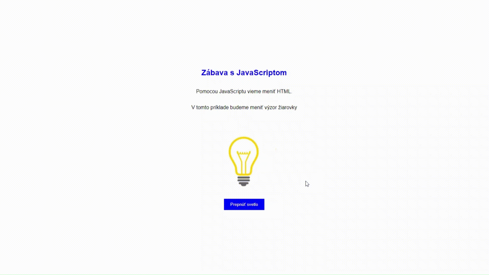

# JavaScript

## Zapni a vypni žiarovku
Cieľom hodiny bude vytvoriť webovú stránku, ktorá bude vyzerať nasledovne:


### Úlohy
1. Vytvorte obrázky `ziarovka_vypnuta.jpg` a `ziarovka_zapnuta.jpg`. Zdoj na stiahnutie obrázkov nájdete po vyhľadaní `lightbulb png` na internete. Žiarovky by mali mať rovnaké rozmery.


2. Vytvorte HTML súbor s názvom `ziarovka.html`.
Skúste samostatne vytvoriť stránku s nadpisom, textami, obrázkom a tlačidlom.

Základný HTML kód pre stránku:
```html
<!DOCTYPE html>
<html lang="sk">
<head>
    <meta charset="UTF-8">
    <meta name="viewport" content="width=device-width, initial-scale=1.0">
    <title>Žiarovka</title>
</head>

<body>
</body>

</html>
```

Pomôcka:
- Nadpis: `<h1>...</h1>`
- Text: `<p>...</p>`
- Obrázok: ``
- Tlačidlo: `<button>...</button>`

Riešenie:
```html
<!DOCTYPE html>
<html lang="sk">
<head>
    <meta charset="UTF-8">
    <meta name="viewport" content="width=device-width, initial-scale=1.0">
    <title>Žiarovka</title>
</head>
<body>
    <h2>Zábava s JavaScriptom</h2>
    
    <p>Pomocou JavaScriptu vieme meniť HTML.</p>
    
    <p>V tomto príklade budeme meniť výzor žiarovky</p>
    
    
    
    <button>Prepnúť svetlo</button>
</body>
</html>
```
Stránka by mala vyzerať nasledovne:


3. Vytvorte JavaScript súbor s názvom `ziarovka.js`.

Kód nášho JavaScriptu:
```javascript
function zmenStavZiarovky() {
    var obrazok = document.getElementById('mojObrazok');
    if (obrazok.src.includes('ziarovka_vypnuta.jpg')) {
        obrazok.src = 'ziarovka_zapnuta.jpg';
    } else {
        obrazok.src = 'ziarovka_vypnuta.jpg';
    }
}
```

Prepojíme JavaScript s HTML:
```html
<!--  tento kód pridáme do <head>...</head>  -->
<script src="ziarovka.js"></script>
```

Prepojíme funkciu s tlačidlom:
```html
<!--  upravíme kód tlačidla  -->
<button onclick="zmenStavZiarovky()">Prepnúť svetlo</button>
```
Teraz by sme mali byť schopní prepínať obrázok žiarovky pomocou tlačidla.

4. Vytvorte CSS súbor s názvom `ziarovka.css`.
V tomto súbore nastavíme štýly pre našu stránku.
```css
body {
    font-family: Arial, sans-serif;
    margin: 0;
    display: flex;
    flex-direction: column;
    justify-content: center;
    align-items: center;
    height: 100vh;
}
h2 {
    color: blue;
}
button {
    background-color: blue;
    color: white;
    padding: 10px 20px;
    margin: 10px 0;
    border: none;
    cursor: pointer;
}
button:hover {
    opacity: 0.8;
}
img {
    width: 200px;
    display: block;
}
```

Prepojíme CSS s HTML:
```html
<!--  tento kód pridáme do <head>...</head>  -->
<link rel="stylesheet" href="ziarovka.css">
```

> **Bonusové úlohy**  ➕

>1. Nastavte obrázok žiarovky tak, aby sa pri načítaní >stránky zobrazil obrázok `ziarovka_zapnuta.jpg`

>2. Upravte farbu nadpisu a tlačidla na stránke na >farbu `LightSeaGreen`  

>3. Zaoblite tlačilo na stránke