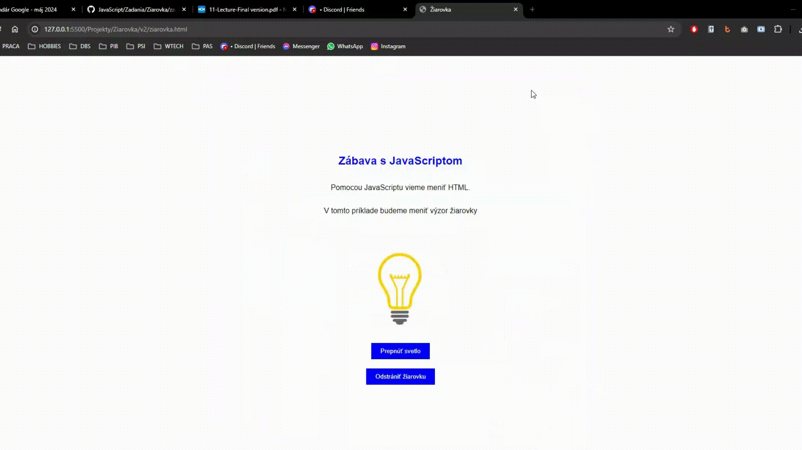

# Pokračovanie z prvého zadania
### Výsledkom tejto hodiny bude nasledovná stránka:


✍️ Spíšme si zoznam udalostí, ktoré sa stanú na stránke po tom, ako používateľ klikne na tlačidlo.

Keď sme definovali zoznam udalostí, musíme pridať do HTML súboru chýbajúce objekty (niektoré stačí upraviť)
    
```html
<button id="tlacidloPrepnut" onclick="zmenStavZiarovky( ">Prepnúť svetlo</button>
<button id="tlacidloOdstranit"onclick="odstranZiarovku()">Odstrániť žiarovku</button>
<button id="tlacidloPridat" onclick="pridajZiarovku()">Pridať žiarovku</button>
```

Tlačidlo "Pridať ťiarovku" musíme skryť, aby ju používatelia nevideli, keď je žiarovka viditeľná.

```css
#tlacidloPridat {
    display: none;
}
```

Pridáme funkciu na vymazanie žiarovky zo stránky.

```javascript
function odstranZiarovku() {
    var potvrdenie = confirm('Naozaj chcete odstrániť žiarovku?');
    var tlacidloPrepnut = document.getElementById('tlacidloPrepnut');
    var tlacidloVymazat = document.getElementById('tlacidloOdstranit');
    var tlacidloPridat = document.getElementById('tlacidloPridat');
    var obrazok = document.getElementById('mojObrazok');

    if (potvrdenie === true) {
        obrazok.style.display = 'none';
    }
    tlacidloVymazat.style.display = 'none';
    tlacidloPrepnut.style.display = 'none';
    tlacidloPridat.style.display = 'inline';
}
```

Pridáme funkciu na pridanie žiarovky na stránku.

```javascript
function pridajZiarovku() {
    var tlacidloVymazat = document.getElementById('tlacidloOdstranit');
    var tlacidloPridat = document.getElementById('tlacidloPridat');
    var tlacidloPrepnut = document.getElementById('tlacidloPrepnut');
    var obrazok = document.getElementById('mojObrazok');
    obrazok.style.display = 'inline';
    tlacidloPrepnut.style.display = 'inline';
    tlacidloVymazat.style.display = 'inline';
    tlacidloPridat.style.display = 'none';
}
```

> **Bonusové úlohy**  ➕

>1. Zariaďte, aby sa žiarovka zobrazovala a skrývala aj keď kliknem na samotnú ťiarovku.

>2. Keď vymažeme žiarovku zo stránky, taktiež odstráňme paragrafy `<p>` z celej stránky. 

>3. Zmenťe farbu nadpisu `<h2>` na stránke na farbu `LightSeaGreen`, keď je žiarovka vymazaná zo stránky.

>4. Nastavte nadpis `<h2>` aby bol podčiarknutý a pod žiarovkou

